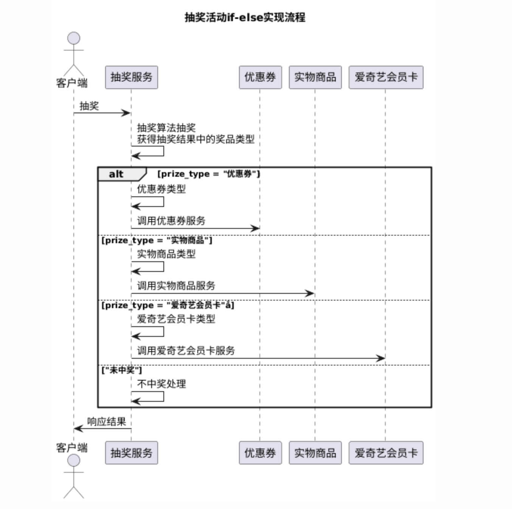
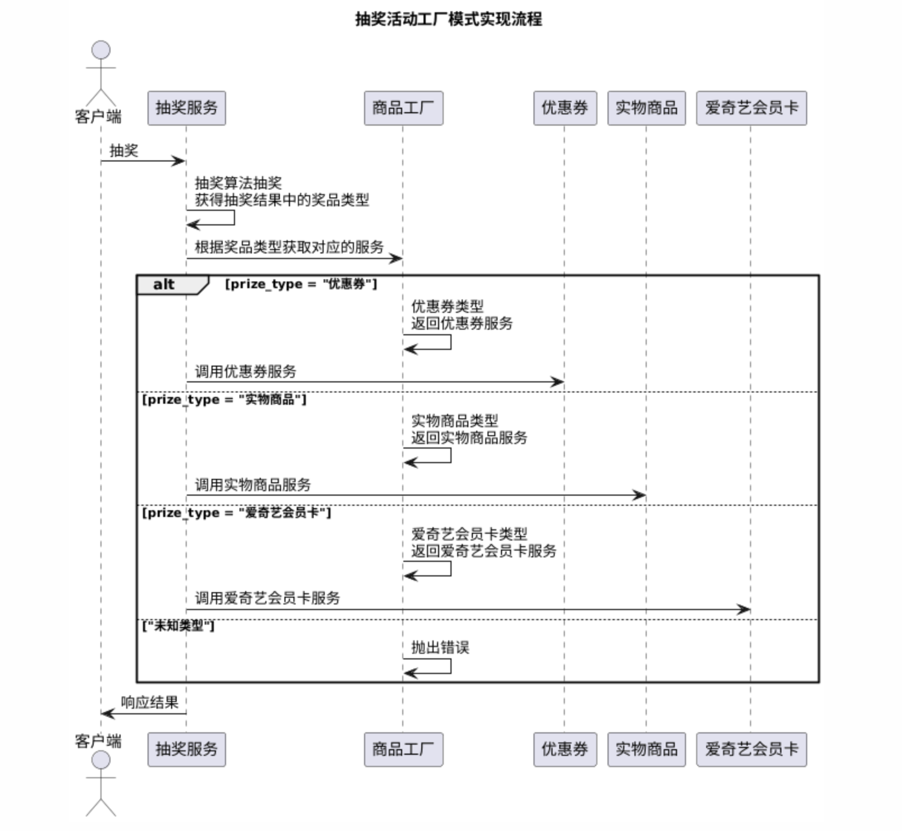

# design-pattern
重学23种设计模式
## 创建者模式
### 工厂模式
业务场景：
营销抽奖活动，根据抽出的商品类型调用对应的商品服务类来执行对应的业务操作。
#### if-else写法

#### 工厂模式

优点：
1. 创建对象和调用对象方法分离，调用方不需要知道创建对象的具体细节。【单一职责原则】
2. 某个商品服务逻辑改变时，只需修改对应服务类，不需要修改调用方，也不需要修改工厂类。【开闭原则】

缺点：
1. 当新增新的商品类型时，需要修改工厂类。